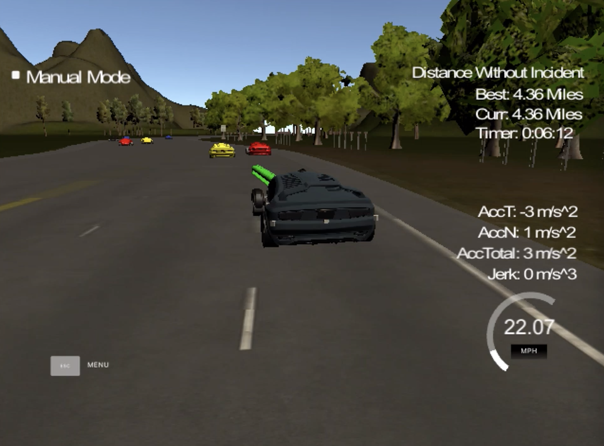
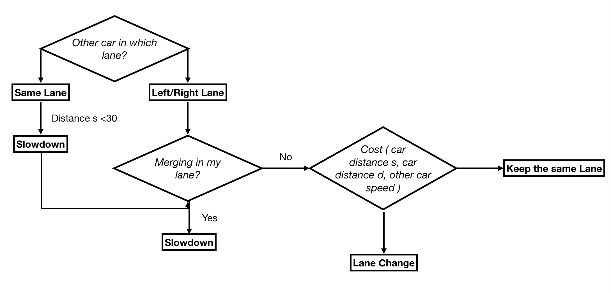

# Path Planning Project
Self-Driving Car Engineer Nanodegree Program
   

## The project
To safely nevigate a car on a highway with provided localization and sensor fusion data while meeting the below requirements:
* The car drives at <= 50 MPH . 
* The car does not exceed a total acceleration of 10 m/s^2 and a jerk of 10 m/s^3.
* The car must not come into contact with any of the other cars on the road.
* The car stays in its lane, except for the time between changing lanes.
* The car is able to change lanes

There is more information regarding the data and instruction of this project at this [repo](https://github.com/udacity/CarND-Path-Planning-Project).

## The code and video 
The code for path planning modal is in main.cpp.
Several runs with [simulator](https://github.com/udacity/self-driving-car-sim/releases/tag/T3_v1.2). shows no viloations of the above requirement. One of the recorded video can be found in the below video on youtube. Click on the below image will bring you to the youtube video.

<a href="http://www.youtube.com/watch?feature=player_embedded&v=IAzth7mGg1w
" target="_blank"></a>

## Reflection

### Path Planning (line 113 to 230)
The behavior is decided as the flow chart below:


The lane change decision is made by calculating the cost function. Three wighting factors 'slowfactor', 'gap factor', and 'diffvfactor' are used to as tuning parameters to optimize the performace.  

* `cost_keep += 49.5/FrontCarSpeed * slowfactor;` --> the cost to keep in the same lane is inverse propotional to the speed of the front car. 
* `cost_right  += gapfactor*gap_th/abs(gap_s) + (FrontCarSpeed - RightCarSpeed)/diffvfacotr; ` --> the cost to change the lane to the right is 1. inverse propotional the the gap_s (the gap between my car and the car in the front) 2. lower if the speed of right car ahead is faster
* `cost_left  += gapfactor*gap_th/abs(gap_s) + (FrontCarSpeed - LeftCarSpeed)/diffvfacotr;` --> same as right lane change cost function.

### Trojectory (line 113 to 230)
The trajectory is plotted out by using previous car path points and lane line points from map data. The selected points are inteperated with '[spline](https://kluge.in-chemnitz.de/opensource/spline/)', which results in a smooth trajectory while changing lanes. The data points are converted between car coordinate and map coordinate in order to simplify the calcluations.(line 286-290 & 337-342) 

### Other thoughts...
I notice that my car speed up and slow down between 2 speeds if there is a slow car in the front before there is a chance to change lane. I guess maybe the PID control coming up later in the program will shine some light on how to solve this problem. 

## Build and Execution

1. Clone the folder `src`.
2. Make a build directory: `mkdir build && cd build`
3. Compile: `cmake .. && make`
4. Run it: `./path_planning`.
5. Open [simulator](https://github.com/udacity/self-driving-car-sim/releases/tag/T3_v1.2).

---

## Dependencies

* cmake >= 3.5
  * All OSes: [click here for installation instructions](https://cmake.org/install/)
* make >= 4.1
  * Linux: make is installed by default on most Linux distros
  * Mac: [install Xcode command line tools to get make](https://developer.apple.com/xcode/features/)
  * Windows: [Click here for installation instructions](http://gnuwin32.sourceforge.net/packages/make.htm)
* gcc/g++ >= 5.4
  * Linux: gcc / g++ is installed by default on most Linux distros
  * Mac: same deal as make - [install Xcode command line tools]((https://developer.apple.com/xcode/features/)
  * Windows: recommend using [MinGW](http://www.mingw.org/)
* [uWebSockets](https://github.com/uWebSockets/uWebSockets)
  * Run either `install-mac.sh` or `install-ubuntu.sh`.
  * If you install from source, checkout to commit `e94b6e1`, i.e.
    ```
    git clone https://github.com/uWebSockets/uWebSockets 
    cd uWebSockets
    git checkout e94b6e1
    ```


